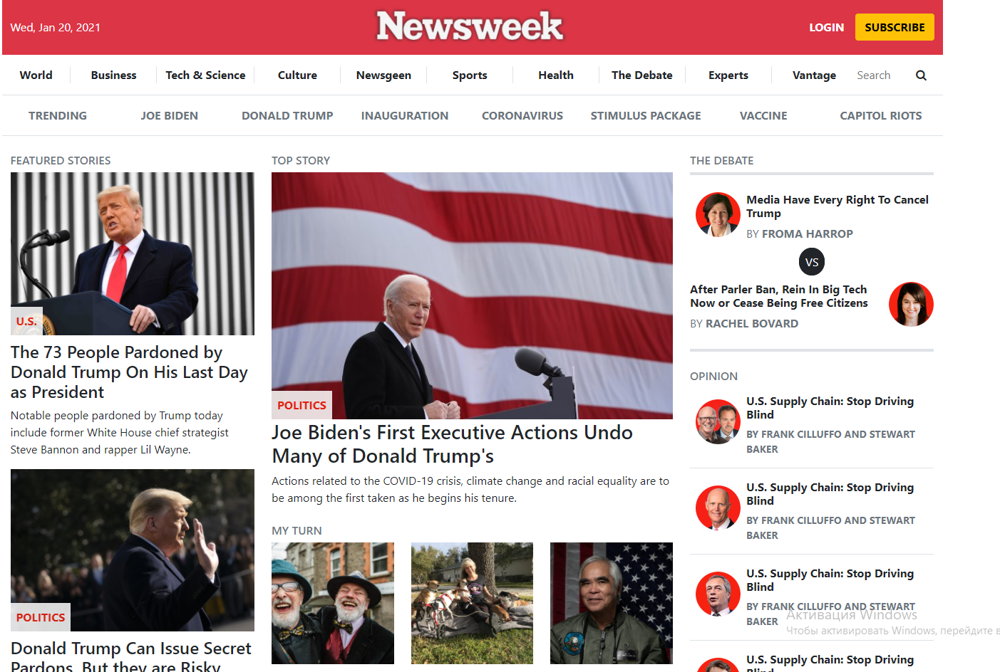

# Newsweek Clone 

> This is a clone of Newsweek Page header, main content and footer.
There we have applied Bootstrap.
It has:
- a responsive header;
- a responsive main with three responsive columns;
- a responsive footer.

## Built With

- HTML & CSS (Bootstrap)

## Authors

👤 **Ilie Babcenco**

- GitHub: [@iliebabcenco](https://github.com/iliebabcenco)
- LinkedIn: [@iliebabcenco](https://www.linkedin.com/in/ilie-babcenco-72459a1b1/)
- Twitter: [@iliebabcenco](https://twitter.com/BabcencoIlie)

👤 **Juliana Osemeke**

- GitHub: [@julianaosemeke](https://github.com/JulianaOsemeke)
- LinkedIn: [@iliebabcenco](http://www.linkedin.com/in/juliana-osemeke)
- Twitter: [@iliebabcenco](https://twitter.com/julianaosemeke)

## Live Demo

https://iliebabcenco.github.io/newsweek-clone/

## 🤝 Contributing

Contributions, issues, and feature requests are welcome!

## Show your support

Give a ⭐️ if you like this project!
